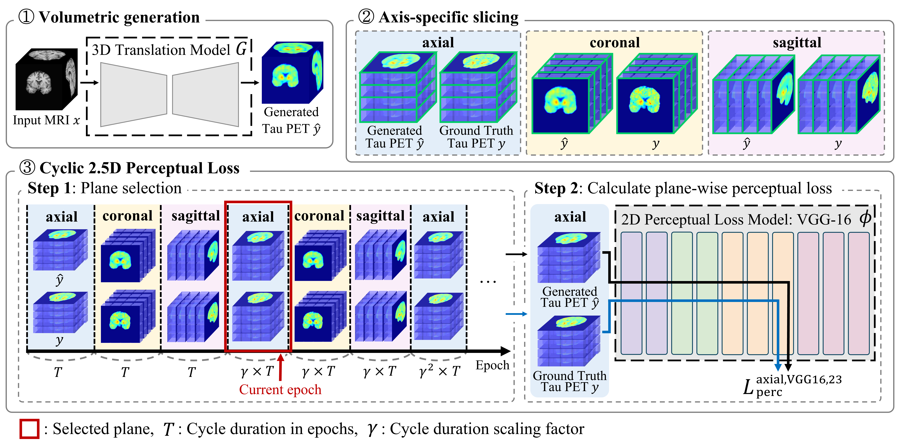

# Cyclic 2.5D Perceptual Loss for Cross-Modal 3D Medical Image Synthesis: T1w MRI to Tau PET


Official PyTorch implemention of the **cyclic 2.5D perceptual loss** proposed in our paper: "[Cyclic 2.5D Perceptual Loss for Cross-Modal 3D Medical Image Synthesis: T1w MRI to Tau PET](https://arxiv.org/abs/2406.12632)."

If you use cyclic 2.5D perceptual loss or this repository in your work, please cite:

> **Cyclic 2.5D Perceptual Loss for Cross-Modal 3D Medical Image Synthesis: T1w MRI to Tau PET**<br>
> https://arxiv.org/abs/2406.12632<br>
> Junho Moon, Symac Kim, Haejun Chung, Ikbeom Jang<br>

## Usage
### Environment Setup
We used Ubuntu 22.04 LTS, Python 3.9, MONAI 1.3.2, Torch 2.0.1, TorchVision 0.15.2, Nibabel 5.1.0, and PyYAML 6.0.1 with Anaconda 3. Install the required libraries using the command:

`pip install -r requirements.txt`

### Structure

```bash
Code/
    ├── train.py
    ├── test.py
    ├── example.yaml
    ├── requirements.txt
    ├── dataset/
        ├── Train/
            ├── MRI/
            ├── PET/
        ├── Val/
            ├── MRI/
            ├── PET/
        ├── Test/
            ├── MRI/
            ├── PET/
```
Any T1w MRI and tau PET NIFTI file pairs will work as long as they follow similar file naming as below (the setting in our experiment; the numbers of file pairs in train/validation/test datasets do not need to be same as below), and tau PET files are registered to the corresponding T1w MRI files. Although same preprocessing as our proposed method is not mandatory, normalization/standardization and skull-stripping are highly recommended.

```bash
Code/
    ├── train.py
    ├── test.py
    ├── example.yaml
    ├── requirements.txt
    ├── dataset/
        ├── Train/
            ├── MRI/
                ├── mri1.nii.gz
                ├── ...
                ├── mri360.nii.gz
            ├── PET/
                ├── pet1.nii.gz
                ├── ...
                ├── pet360.nii.gz
        ├── Val/
            ├── MRI/
                ├── mri361.nii.gz
                ├── ...
                ├── mri438.nii.gz
            ├── PET/
                ├── pet361.nii.gz
                ├── ...
                ├── pet438.nii.gz
        ├── Test/
            ├── MRI/
                ├── mri439.nii.gz
                ├── ...
                ├── mri516.nii.gz
            ├── PET/
                ├── pet439.nii.gz
                ├── ...
                ├── pet516.nii.gz
```

### Training and Inference
Modify the YAML file (you can rename it) to set your preferred configurations (e.g., environment name, data augmentation, batch size, dropout, maximum epochs). Although we did not use gradient accumulation in our experiments, you can activate it by changing `GRAD_ACCUM_STEPS` in the YAML file.
To train the model, run:


`python train.py --config example.yaml`


Replace `example.yaml` with your YAML file name if changed. Checkpoints will be saved in the directory specified by MODEL_DIR in the YAML file. For example, with `MODEL_DIR: saved_models/example`, checkpoints will be stored in `.../Code/saved_models/example`. Resume training using:


`python train.py --config example.yaml --checkpoint path/to/the/checkpoint.pth`


To apply the trained model to images, run:


`python test.py --config example.yaml`


The outputs will be saved according to the `OUTPUT_SUBDIR` specified in the YAML file. The results will be stored as `.../Code/dataset/Test/{OUTPUT_SUBDIR}/output{number}.nii.gz`.
